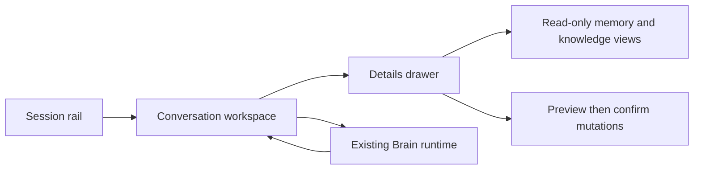

# Desktop MVP v0.1

**Status:** Initial Tkinter shell implemented; broader MVP views remain planned.

## Purpose

Define the smallest private desktop surface that makes Hypatia's existing,
local-first runtime understandable and useful without inventing new agent,
voice, browser, cloud, or storage behavior.

This document defines the design-first boundary in
[Desktop Application](../Modules/Desktop.md). ADR 0001 records the selected
Tkinter technology, and the first tested shell implements only its smallest
three flows: text chat, explicit session selection, and semantic status.

## Source-backed capability boundary

The MVP may present only current Brain/CognitiveEngine capabilities:

- normal conversation through the existing optional local or configured LLM;
- session overview, selection, read-only detail/activity/recent/search views,
  and existing rename/delete preview-and-confirm flows;
- explicit lexical and semantic conversation recall, including semantic-runtime
  status;
- read-only local knowledge context, graph, source-catalog, and relation-catalog
  views;
- the existing explicit `ask knowledge` request; and
- preview-and-confirm application or removal of an explicit knowledge relation.

The MVP must not claim or silently add voice capture, document import, web
research, automatic prompt augmentation, cross-document semantic extraction,
agent/tool execution, synchronization, telemetry, or multi-user access.

## Design principles

- **Local by default:** local state and current runtime status are visible; no
  data leaves the device except through an already enabled user-configured LLM
  or Ollama runtime.
- **Explicit before mutation:** session rename/delete and knowledge-relation
  application/removal always show the existing preview first and require an
  explicit final user action.
- **Truthful status:** a disabled, initializing, unavailable, or failed
  capability is shown as such. The interface never implies that semantic
  retrieval, LLM chat, or persistence succeeded without the runtime response.
- **Readable evidence:** knowledge answers retain the citations already
  returned by Hypatia; the interface does not manufacture citations.
- **No parallel data model:** the interface is an adapter over `Brain` and its
  responses, never a second memory, session, or relation store.

## Primary layout

### 1. Session rail

Shows the active session and an ordered list of known session IDs. The initial
shell refreshes this list and its conversation counts through a read-only Brain
overview; selecting a row fills the session field, while activation remains an
explicit separate action. The initial shell also provides explicit read-only
details, activity, and recent-conversation views for the selected session. The
rail must not display data from an unknown session as a substitute for a failed
lookup.

### 2. Conversation workspace

Contains the current session transcript, a text composer, a send action, and a
compact runtime indicator.

- A submitted message is passed unchanged to `Brain.process` after normal
  UI-only empty-input prevention.
- The workspace renders the returned message and its existing intent/result
  state; it does not retry a failed request invisibly.
- The workspace may show only status exposed by existing runtime responses. It
  must not infer, render, or expose API keys or full secret-bearing environment
  values.

### 3. Details drawer

Provides explicit, user-selected views instead of automatic retrieval:

| View | User action | Required presentation boundary |
| --- | --- | --- |
| Recall | Enter a recall query | Label lexical, semantic, hybrid, or fallback results exactly as returned. |
| Semantic status | Select “Semantic status” | Read-only; do not issue an embedding query. |
| Knowledge | Enter a knowledge query | Preserve source citation/title/path information already returned. |
| Knowledge graph | Request a graph view | Show only bounded, cited relationships returned by the runtime. |
| Sessions | Select overview/detail/activity/recent/search | Keep these requests read-only unless the user enters a mutation flow. |

The initial shell implements the Recall and Semantic recall actions as separate
query controls. It does not issue either request from ordinary chat text.
It also implements the separate, bounded, cited `Knowledge context` action;
this local retrieval does not call an LLM or mutate conversation memory.
The same explicitly entered query can request the existing bounded, cited
`Knowledge graph` view, while `Loaded sources` opens the existing read-only
local source catalog. Neither action calls an LLM, augments ordinary chat, or
changes conversation memory or knowledge state.
`Ask sources` is separately user initiated: it sends the entered question only
through the existing `ask knowledge` local-RAG path. The runtime keeps its
bounded cited-source and safe unavailable/failure behavior; this action never
augments ordinary chat or changes conversation memory.
For every knowledge response that already carries source records, the transcript
also renders those records in response order: title, local path, paragraph, and
chunk ID. It does not invent, resolve, persist, or reorder citations.
The shell also implements the first mutation flow for an explicit local source
relation: two entered IDs first receive the runtime's read-only preview. The
window presents that exact preview in a confirmation dialog; only an explicit
approval calls the existing revalidating apply command. A declined or failed
preview leaves the graph, JSON memory, and conversation memory unchanged.
The matching `Preview and remove` action follows the existing relation-removal
contract: it first displays its read-only removal preview and sends the
separate revalidating removal command only after explicit approval. Declining
or failing the preview leaves the graph, JSON memory, and conversation memory
unchanged.
`Active links` opens the existing deterministic read-only local relation
catalog, including the persistence state of each active link. It does not load
sources, call an LLM, or modify graph, JSON memory, or conversation memory.
The shell also implements session rename through the existing two-stage runtime
contract: select a source session, enter a replacement ID, inspect the exact
read-only preview, then explicitly confirm before the revalidating rename call.
After success it refreshes the session list from Brain; a failed or declined
preview leaves session and memory state unchanged.
Session deletion first reads the existing structured runtime preview. The UI
offers confirmation only when that preview explicitly allows deletion; blocked
or failed previews cannot invoke the delete command. A successful deletion
clears the selection and refreshes the session list from Brain.

## Mutation flows

The interface must use the current two-stage runtime contracts. A visual
confirmation is an additional guard, not a replacement for runtime validation.

| Action | Stage 1 | Stage 2 | Confirmation content |
| --- | --- | --- | --- |
| Rename session | Request runtime preview | Submit runtime rename only after user confirms | Old and new session IDs, affected-memory count, and any runtime warning. |
| Delete session | Request runtime preview | Submit runtime delete only after user confirms | Session ID, memory-record count, and irreversible-result warning. |
| Add knowledge relation | Request runtime relation preview | Submit apply only after user confirms | Source and target IDs, `related_to`, persistence status. |
| Remove knowledge relation | Request runtime removal preview | Submit remove only after user confirms | Source and target IDs, relation type, persistence status. |

If a preview fails, the underlying state changes, or the runtime rejects the
final action, the dialog closes with the returned failure state and no
optimistic local update is retained.

## Privacy and safety requirements

1. Do not add analytics, telemetry, crash uploads, cloud synchronization, or
   background web requests.
2. Do not persist drafts, queries, citations, or response copies outside the
   runtime's existing local persistence policy without a separately reviewed
   decision.
3. Never render an LLM API key, authorization header, raw environment dump, or
   provider exception details.
4. Do not automatically call `ask knowledge`, semantic recall, or any mutation
   from ordinary chat text; each remains an explicit user-selected flow.
5. Keep standard copy/paste and keyboard navigation local. If a future
   framework includes a web view, its content-security and navigation policy
   requires a separate security review.

## Accessibility baseline

- Every action is keyboard reachable and has a visible focus state.
- Controls have text labels; icons never carry the only meaning.
- Status, error, and confirmation messages are readable by assistive
  technology and do not rely on color alone.
- Transcript text supports user-controlled sizing and a high-contrast theme.
- Destructive confirmation defaults to the non-destructive choice and has no
  time pressure.

## Error and offline behavior

- Startup keeps the current runtime's local persistence behavior; a disabled
  LLM or semantic runtime is a usable local state, not a fatal interface error.
- Transport, parsing, or validation failures are displayed as the safe runtime
  message. The UI must not expose internal paths, tokens, stack traces, or raw
  provider bodies.
- The interface does not queue or replay messages automatically after failure.
  The user chooses whether to retry.

## Acceptance criteria for the first shell and follow-up views

1. **Met:** Tkinter calls the existing Python runtime without bypassing `Brain`,
   writing a duplicate store, or adding a background network channel.
2. Each source-backed view in this document has an automated adapter or
   end-to-end test for normal, disabled/unavailable, and failure states.
3. Each mutation flow proves preview, confirmation, final runtime validation,
   and failure/rollback presentation.
4. **Met for the first shell:** text chat, session selection, and runtime
   status are implemented through a headless-tested controller. Knowledge and
   mutation drawers are added only after their read-only and confirmation paths
   are individually tested.
5. **Partially met:** Tkinter and the no-web-view policy are recorded in ADR
   0001. Packaging, update policy, and accessibility verification remain open
   before a distributable desktop release.

## Open decisions

- The first shell uses native Python Tkinter; see
  [ADR 0001](../Decisions/0001-tkinter-desktop-shell.md). Packaging remains a
  separate decision.
- Cross-platform support target for the first release.
- The visual identity, color system, and typography, which belong in separate
  design documents rather than runtime code.
