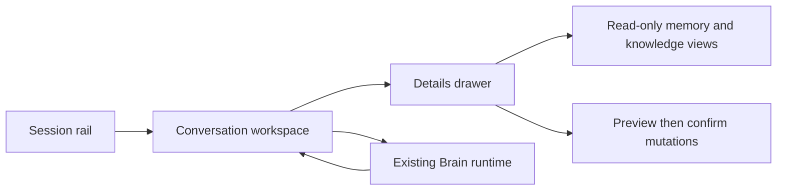

# Desktop MVP v0.1

**Status:** Initial Tkinter shell, explicit HTTPS source intake, persistent
research-run controls, and a bounded research workflow layout implemented;
broader MVP views remain planned.

## Purpose

Define the smallest private desktop surface that makes Hypatia's existing,
local-first runtime understandable and useful without inventing new agent,
voice, browser, cloud, or duplicate storage behavior.

This document defines the design-first boundary in
[Desktop Application](../Modules/Desktop.md). ADR 0001 records the selected
Tkinter technology; the tested shell incrementally exposes only the existing
Brain capabilities described below.

## Source-backed capability boundary

The MVP may present only current Brain/CognitiveEngine capabilities:

- normal conversation through the existing optional local or configured LLM;
- session overview, selection, read-only detail/activity/recent/search views,
  and existing rename/delete preview-and-confirm flows;
- explicit lexical and semantic conversation recall, including semantic-runtime
  status;
- read-only local knowledge context, graph, source-catalog, and relation-catalog
  views;
- explicit loading of one user-selected local Markdown or plain-text source;
- explicit loading of one user-entered public HTTPS text source through the
  current research acquisition boundary;
- explicit creation/listing of persistent research runs through a read-only
  question/status/ID selector, plus optional attachment of a source to that
  explicitly selected run;
- a compact selected-run status and complete source/evidence/claim count summary
  derived only from the selector's already loaded immutable snapshot;
- one shared read-only current-run context value, repeated on the sources,
  authored-analysis, and review steps with bounded question, status, and exact
  run ID plus non-stale empty/invalid guidance;
- one shared progress value on those same three steps with complete source,
  evidence, and claim counts from the immutable selected snapshot;
- a bounded Overview workflow snapshot with all existing source/evidence and
  authored-analysis record counts plus the current run status, without an
  inferred readiness or conclusion;
- a bounded local filter over the already loaded immutable run catalog, with
  question/exact-status/exact-ID matching, result counts, explicit no-match,
  active-selection preservation, and clear restoration;
- four explicit deterministic local orders for the current loaded or filtered
  run view, with current-sort feedback, ascending run-ID ties, and immutable
  catalog/filter/active-selection preservation;
- an explicit local `Show active run` recovery action for a filtered-out active
  row, with sort/authored-field preservation and stale-state refusal;
- an All/Collecting/Completed/Failed/Cancelled local status facet that composes
  with bounded text and deterministic sort while preserving active/authored
  state and reporting visible/total membership;
- a compact complete All/Collecting/Completed/Failed/Cancelled catalog summary
  derived only from the immutable loaded tuple, invariant under filtering and
  sorting, with explicit zeroes for an empty catalog;
- a bounded selected-run metadata line with timezone-aware created/updated
  timestamps and aggregate safe-failure count, without failure detail;
- a read-only accepted-source selector from that same run snapshot, with
  explicit exact-ID handoffs to the manual assessment and comparison fields;
- a source-filtered read-only evidence selector with bounded excerpts, exact
  IDs, and separate handoffs to manual assessment, claim, and comparison fields;
- a source-filtered read-only authored-assessment selector that distinguishes
  current/superseded state and offers explicit current-ID handoffs;
- a selected-run read-only authored-claim selector that exposes audit state,
  epistemic state, confidence, bounded text, exact ID, and guarded handoffs;
- a selected-run read-only persisted-contradiction selector with exact claim
  pair, bounded authored note, recorded time, ID, and explicit pair handoff;
- a selected-run read-only persisted comparison-note selector with bounded text,
  time, exact ID/reference summary, and three isolated reference handoffs;
- four ordered presentation-only Research workflow tabs, plus four Authored
  analysis sub-tabs, that retain every existing field and command without
  opening a runtime action when navigation changes;
- read-only accepted-content restoration status captured during startup, with
  only availability and aggregate restored document/paragraph counts;
- explicit recording and read-only viewing of a selected attached-source chunk
  as bounded research evidence;
- preview-and-confirm recording of user-authored source assessments that cite
  only explicitly entered evidence IDs from the selected accepted source;
- preview-and-confirm recording of one user-reviewed contradiction relationship
  between exactly two persisted claims, with the claims' exact combined
  evidence and the user's own note displayed before confirmation;
- explicit, cancellable, read-only LLM suggestions for possible contradiction
  pairs among bounded current claims, with exact persisted evidence provenance
  and an explicit selected-pair ID handoff that never copies rationale or
  records automatically;
- read-only side-by-side comparison of two to five explicitly selected accepted
  sources, using persisted provenance, user-selected evidence, and only current
  user-authored assessments without an automatic verdict or score;
- preview-and-confirm recording of a user-authored comparison note that cites
  explicit evidence and current assessment IDs covering the exact selected
  sources, without generated text, reference selection, verdicts, or scores;
- read-only Markdown export preview for one terminal research run, generated
  only from persisted audit records with bounded display, escaped remote and
  authored text, a safe suggested basename, and a full-content fingerprint;
- separately confirmed Markdown save for that exact preview, with a
  user-selected new-file destination, final snapshot/hash revalidation, and
  atomic no-overwrite publication;
- read-only verification of one selected existing Markdown export against the
  current terminal-run byte count and SHA-256, without decoding, importing,
  repairing, or changing either side;
- preview-and-confirm transition of a collecting research run to one terminal
  lifecycle status;
- an explicit Crossref scholarly-metadata discovery request for a selected
  collecting run, a read-only candidate view, and a separate action that copies
  one selected DOI URL into the existing source-load field without fetching it;
- the existing explicit `ask knowledge` request; and
- preview-and-confirm application or removal of an explicit knowledge relation.

The MVP must not claim or silently add voice capture, PDF import, unattended
source discovery, multi-source web research/synthesis, automatic prompt
augmentation, cross-document semantic extraction, agent/tool execution,
synchronization, telemetry, or multi-user access.

## Design principles

- **Local by default:** local state and current runtime status are visible; data
  leaves the device only through an already enabled user-configured LLM/Ollama
  runtime, an explicit user-entered HTTPS source request, or the explicit
  `Find sources` request that sends the persisted research question to
  Crossref.
- **Explicit before mutation:** session rename/delete and knowledge-relation
  application/removal always show the existing preview first and require an
  explicit final user action.
- **Truthful status:** a disabled, initializing, unavailable, or failed
  capability is shown as such. The interface never implies that semantic
  retrieval, LLM chat, or persistence succeeded without the runtime response.
- **Readable evidence:** knowledge answers retain the citations already
  returned by Hypatia; the interface does not manufacture citations.
- **No parallel data model:** the interface is an adapter over `Brain` and its
  responses, never a second memory, session, or relation store.

## Primary layout

### 1. Session rail

Shows the active session and an ordered list of known session IDs. The initial
shell refreshes this list and its conversation counts through a read-only Brain
overview; selecting a row fills the session field, while activation remains an
explicit separate action. The initial shell also provides explicit read-only
details, activity, and recent-conversation views for the selected session. The
rail must not display data from an unknown session as a substitute for a failed
lookup.

### 2. Conversation workspace

Contains the current session transcript, a text composer, a send action, and a
compact runtime indicator.

- A submitted message is passed unchanged to `Brain.process` after normal
  UI-only empty-input prevention.
- The workspace renders the returned message and its existing intent/result
  state; it does not retry a failed request invisibly.
- The workspace may show only status exposed by existing runtime responses. It
  must not infer, render, or expose API keys or full secret-bearing environment
  values.

### 3. Details drawer

Provides explicit, user-selected views instead of automatic retrieval:

| View | User action | Required presentation boundary |
| --- | --- | --- |
| Recall | Enter a recall query | Label lexical, semantic, hybrid, or fallback results exactly as returned. |
| Semantic status | Select “Semantic status” | Read-only; do not issue an embedding query. |
| Knowledge | Enter a knowledge query | Preserve source citation/title/path information already returned. |
| Knowledge graph | Request a graph view | Show only bounded, cited relationships returned by the runtime. |
| Sessions | Select overview/detail/activity/recent/search | Keep these requests read-only unless the user enters a mutation flow. |

The initial shell implements the Recall and Semantic recall actions as separate
query controls. It does not issue either request from ordinary chat text.
It also implements the separate, bounded, cited `Knowledge context` action;
this local retrieval does not call an LLM or mutate conversation memory.
The same explicitly entered query can request the existing bounded, cited
`Knowledge graph` view, while `Loaded sources` opens the existing read-only
local source catalog. Neither action calls an LLM, augments ordinary chat, or
changes conversation memory or knowledge state.
The Research tab presents its existing controls as `Overview`, `Sources &
evidence`, `Authored analysis`, and `Review & export`. The authored-analysis
section further separates saved records, comparison, assessment, and
claims/contradictions. These are navigation-only Tkinter notebooks: all fields,
commands, previews, confirmations, and runtime boundaries remain the existing
ones, and switching sections changes no selected value or persisted state.
`Load file` opens a native picker for exactly one `.md` or `.txt` file. The
desktop passes that selected path to the existing Brain boundary as a structured
local-source request; the runtime validates and indexes it before returning its
title, source path, type, chunk count, and stable ID. Cancelling selection,
unsupported types, empty/missing files, and duplicate sources remain controlled
runtime outcomes: the desktop does not create a second store, alter
conversation memory, invoke an LLM, or retain a partial local source.
`Load source` sends exactly one explicitly entered URL through the structured
research-source request. The runtime validates public HTTPS resolution and
redirects, pins each connection to an exact validated public address while
retaining hostname-based TLS certificate checks. A failed setup advances only
through the remaining addresses from that validation within one shared time
budget. The runtime bounds response type/size/time, extracts readable text,
and indexes the source with its final URL. `Start research` persists one
question and selects the returned run ID; `Research runs` lists the current
audit catalog.
When a run ID is present, a successful source load also persists provenance,
and saves exact extracted text to the separate schema-v1 accepted-content store
before publishing that provenance. Content-store failure removes the new
knowledge document; a later audit-write failure restores the prior content
collection and independently rolls the document back. On startup, Bootstrap
restores only saved records whose stable document identity and source metadata
exactly match accepted run provenance. It performs no network request or
persistent write, bounds the rebuilt index to 20,000 paragraphs, and fails
before partial use of orphaned, conflicting, or modified records.
`Research content` displays the immutable status captured by that startup
operation. It does not reopen the content store and never displays content,
paths, hashes, source metadata, record IDs, or internal validation errors.
Accepted-source paragraphs use a versioned identity bound to document ID,
position, and exact text during both initial indexing and startup restoration.
The desktop does not calculate or persist this identity itself.
`Evidence integrity` separately reports only aggregate recorded, matched,
missing, and changed counts from an in-memory bounded audit. It does not display
evidence IDs, source IDs, content, paths, hashes, or internal errors and does not
repair either the run snapshot or accepted content.
`Find sources` separately sends the selected collecting run's persisted
question to the fixed Crossref REST v1 metadata endpoint and displays at most
five ordered DOI candidates. The endpoint and its same-origin redirects use
public-address-pinned, hostname-verified TLS. `Use selected URL` copies only
the chosen DOI URL into the HTTPS field; it does not invoke `Load source`, and
a candidate rendered for another run cannot be reused after the run ID changes.
`Preview & load`
requests a no-side-effect runtime decision for the exact run, discovery, and
candidate, asks for confirmation, and then revalidates before delegating to the
existing source loader. The Crossref and preview actions do not retrieve a
paper, crawl links, invoke an LLM, write conversation memory, or duplicate
document content in the run store.
`Save evidence` requires the selected run ID, a currently indexed chunk ID, and
a user note. The runtime accepts it only from a source attached to that run and
stores a bounded excerpt plus its exact source/chunk locator and full-chunk
fingerprint. `View evidence` reads this audit record after restart; neither
action chooses evidence or evaluates a claim automatically.
`Preview assessment` requires the selected run ID and one source document ID
already accepted by that run. A successful attachment fills this field for
convenience, but the preview remains separately user initiated. It renders only
persistent source provenance and evidence already selected for that source; it
does not access the network or live index, invoke an LLM, write memory or graph
state, persist a decision, or calculate trust and quality scores.
The accepted-source selector is populated only from the currently selected
loaded `ResearchRun`. Its title-and-ID labels are read-only: changing the choice
does not touch authored form values. `Use for assessment` copies one exact ID to
the single-source field, while `Add to comparison` appends it once to the
ordered comparison field without exceeding five IDs. Both are presentation-only
handoffs and reject a source snapshot belonging to another run.
The evidence selector uses only records in that same loaded `ResearchRun` whose
source document ID matches the chosen accepted source. Labels normalize the
bounded excerpt to one line while retaining the exact evidence ID. Selection
alone edits nothing. Explicit handoffs append the ID once to the assessment,
claim, or comparison evidence field; assessment requires the matching manual
source, comparison requires source membership, and the existing 20/100 limits
remain enforced. Stale run/source state is cleared before any handoff.
The authored-assessment selector filters that same source in the loaded run.
Labels show `current` or `superseded`, bounded user text, and exact ID, and the
first current record is selected for convenience without editing any field.
Only a current same-source assessment can be explicitly copied into the manual
predecessor field or appended once to comparison assessment IDs. Comparison
source membership, stale state, duplicates, and the 50-ID limit fail locally.
The authored-claim selector reads only the claims already present in the selected
loaded run. Labels show `current` or `superseded`, epistemic state, categorical
confidence, bounded user text, and exact ID, and prefer the first current record
without editing any manual field. Separate explicit handoffs accept only a
current claim and either replace the predecessor field or append once to the
contradiction field. Stale state, duplicates, and the exact two-ID bound fail
locally without a Brain request, persistence operation, provider, or mutation.
The persisted-contradiction selector reads only `claim_contradictions` already
present in that loaded run. Labels show both exact claim IDs, bounded one-line
authored note, timezone-aware recorded time, and exact contradiction ID. Selection
edits nothing. A separate explicit handoff replaces only the two-ID manual field,
preserves the manual note, and rejects stale or invalid selection state locally
without Brain, storage, provider, network, LLM, or mutation work.
The persisted comparison-note selector likewise reads only `comparison_notes`
already present in that run. Its label bounds authored text while retaining time
and exact note ID. A separate read-only summary exposes all exact source,
evidence, and assessment IDs for the selected record. Selection edits no form
field; source, evidence, and assessment handoffs each replace only their matching
manual field and preserve comparison text plus all non-target fields. Stale state
fails locally without a runtime boundary.
`Preview & save assessment` also accepts an optional predecessor assessment ID.
The preview shows the exact link; confirmation sends the captured value, and
the runtime revalidates that it is an unsuperseded assessment from the same run
and source before appending. Both records remain visible in audit history.
`Preview & save comparison note` reuses the ordered `Compare sources` selection
and additionally requires authored text plus explicit evidence and current
assessment IDs. The preview performs no write; the confirmed action revalidates
the open run, accepted sources, ownership and coverage of every reference, and
then atomically appends. Later comparison previews show only notes for that exact
source order, bounded to 20 displayed notes with the complete count reported.
`Export preview` takes only the selected terminal run ID. The runtime renders
the immutable snapshot deterministically, escapes untrusted Markdown structure,
bounds the transcript display, and returns the snapshot time plus complete
content fingerprint. It does not open a file dialog, accept a destination, or
write a document. `Save export` is a separate action bound to that displayed
preview: the desktop chooses and confirms a destination, then Brain re-renders
and revalidates the run before atomically creating a complete UTF-8 `.md` file.
Existing destinations are never replaced, and no research audit state changes.
`Verify export` is independent of the preview state. It requires the selected
terminal run and one existing `.md` file, streams the complete stable regular
file, and reports its observed byte count and SHA-256 beside the deterministic
expected values. Exact match and mismatch are both successful read-only
outcomes; unsafe file types, unstable reads, and oversized unexpected input are
controlled failures.
The `Final status` selector exposes only completed, failed, and cancelled. The
window first renders the runtime preview and opens confirmation only for an
allowed decision; the separate update call revalidates before persistence.
Completed requires at least one accepted source and evidence record. Every
failed outcome requires a failure record. Every terminal status is irreversible
and closes further run mutation.
`Ask sources` is separately user initiated: it sends the entered question only
through the existing `ask knowledge` local-RAG path. The runtime keeps its
bounded cited-source and safe unavailable/failure behavior; this action never
augments ordinary chat or changes conversation memory.
For every knowledge response that already carries source records, the transcript
also renders those records in response order: title, local path, paragraph, and
chunk ID. It does not invent, resolve, persist, or reorder citations.
The shell also implements the first mutation flow for an explicit local source
relation: two entered IDs first receive the runtime's read-only preview. The
window presents that exact preview in a confirmation dialog; only an explicit
approval calls the existing revalidating apply command. A declined or failed
preview leaves the graph, JSON memory, and conversation memory unchanged.
The matching `Preview and remove` action follows the existing relation-removal
contract: it first displays its read-only removal preview and sends the
separate revalidating removal command only after explicit approval. Declining
or failing the preview leaves the graph, JSON memory, and conversation memory
unchanged.
`Active links` opens the existing deterministic read-only local relation
catalog, including the persistence state of each active link. It does not load
sources, call an LLM, or modify graph, JSON memory, or conversation memory.
The shell also implements session rename through the existing two-stage runtime
contract: select a source session, enter a replacement ID, inspect the exact
read-only preview, then explicitly confirm before the revalidating rename call.
After success it refreshes the session list from Brain; a failed or declined
preview leaves session and memory state unchanged.
Session deletion first reads the existing structured runtime preview. The UI
offers confirmation only when that preview explicitly allows deletion; blocked
or failed previews cannot invoke the delete command. A successful deletion
clears the selection and refreshes the session list from Brain.

## Mutation flows

The interface must use the current two-stage runtime contracts. A visual
confirmation is an additional guard, not a replacement for runtime validation.

| Action | Stage 1 | Stage 2 | Confirmation content |
| --- | --- | --- | --- |
| Rename session | Request runtime preview | Submit runtime rename only after user confirms | Old and new session IDs, affected-memory count, and any runtime warning. |
| Delete session | Request runtime preview | Submit runtime delete only after user confirms | Session ID, memory-record count, and irreversible-result warning. |
| Add knowledge relation | Request runtime relation preview | Submit apply only after user confirms | Source and target IDs, `related_to`, persistence status. |
| Remove knowledge relation | Request runtime removal preview | Submit remove only after user confirms | Source and target IDs, relation type, persistence status. |
| Add claim contradiction | Request runtime write preview | Submit record only after user confirms | Run ID, both claim IDs and texts, their exact combined evidence IDs, the user's note, and a warning that Hypatia does not decide truth. |

If a preview fails, the underlying state changes, or the runtime rejects the
final action, the dialog closes with the returned failure state and no
optimistic local update is retained.

## Privacy and safety requirements

1. Do not add analytics, telemetry, crash uploads, cloud synchronization, or
   background web requests.
2. Do not persist drafts, queries, citations, or response copies outside the
   runtime's existing local persistence policy without a separately reviewed
   decision.
3. Never render an LLM API key, authorization header, raw environment dump, or
   provider exception details.
4. Do not automatically call `ask knowledge`, semantic recall, or any mutation
   from ordinary chat text; each remains an explicit user-selected flow.
5. Do not propose contradictions in the background or record suggestions. The
   user must explicitly request review, select a pair or supply both persisted
   claim IDs manually, and author their own note through the separate
   preview-confirm-record flow.
6. Keep standard copy/paste and keyboard navigation local. If a future
   framework includes a web view, its content-security and navigation policy
   requires a separate security review.

## Accessibility baseline

- Every action is keyboard reachable and has a visible focus state.
- Controls have text labels; icons never carry the only meaning.
- Status, error, and confirmation messages are readable by assistive
  technology and do not rely on color alone.
- **Met for local controls:** the user can change the interface text size from
  10 through 20 points and choose Eye comfort, Light, or High contrast. Eye
  comfort is the default and avoids pure black/white surfaces; every theme
  retains explicit focus, selection, disabled, and read-only states. These
  presentation preferences do not persist data, invoke a provider, or change
  conversation, session, knowledge, or research state.
- Destructive confirmation defaults to the non-destructive choice and has no
  time pressure.

## Error and offline behavior

- Startup keeps the current runtime's local persistence behavior; a disabled
  LLM or semantic runtime is a usable local state, not a fatal interface error.
- Transport, parsing, or validation failures are displayed as the safe runtime
  message. The UI must not expose internal paths, tokens, stack traces, or raw
  provider bodies.
- The interface does not queue or replay messages automatically after failure.
  The user chooses whether to retry.

## Acceptance criteria for the first shell and follow-up views

1. **Met:** Tkinter calls the existing Python runtime without bypassing `Brain`,
   writing a duplicate store, or adding a background network channel.
2. Each source-backed view in this document has an automated adapter or
   end-to-end test for normal, disabled/unavailable, and failure states.
3. Each mutation flow proves preview, confirmation, final runtime validation,
   and failure/rollback presentation.
4. **Met for the first shell:** text chat, session selection, and runtime
   status are implemented through a headless-tested controller. Knowledge and
   mutation drawers are added only after their read-only and confirmation paths
   are individually tested.
5. **Partially met:** Tkinter and the no-web-view policy are recorded in ADR
   0001. ADRs 0002 and 0003 define Windows and Ubuntu 24.04 x64 onedir packages,
   platform-owned data boundaries, manual updates, and executable startup
   checks. Local text-size and high-contrast controls are implemented and
   headlessly verified; a full assistive-technology and manual accessibility
   audit remains open.

## Open decisions

- The first shell uses native Python Tkinter; see
  [ADR 0001](../Decisions/0001-tkinter-desktop-shell.md). Windows packaging is
  defined by [ADR 0002](../Decisions/0002-windows-desktop-distribution.md), and
  the Ubuntu 24.04 x64 package by
  [ADR 0003](../Decisions/0003-linux-desktop-distribution.md).
- macOS and additional Linux distribution/architecture targets.
- The visual identity, color system, and typography, which belong in separate
  design documents rather than runtime code.
